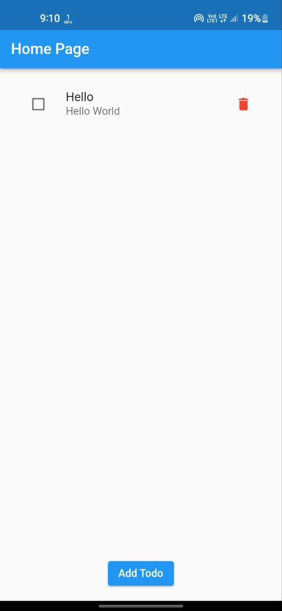
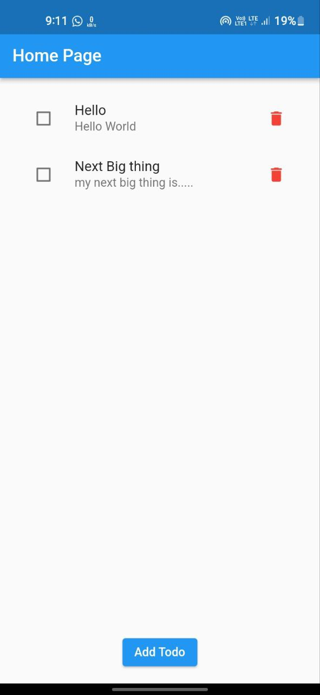
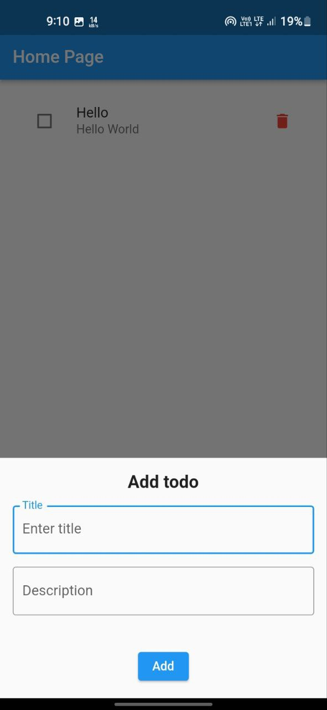

# flutter_todo

Todo application made using [Flutter](https://flutter.dev/).

## Screenshots

## Tech Stack

### State Management

- [BLoC](https://pub.dev/packages/flutter_bloc)

### Database

- [Floor](https://pub.dev/packages/floor)

